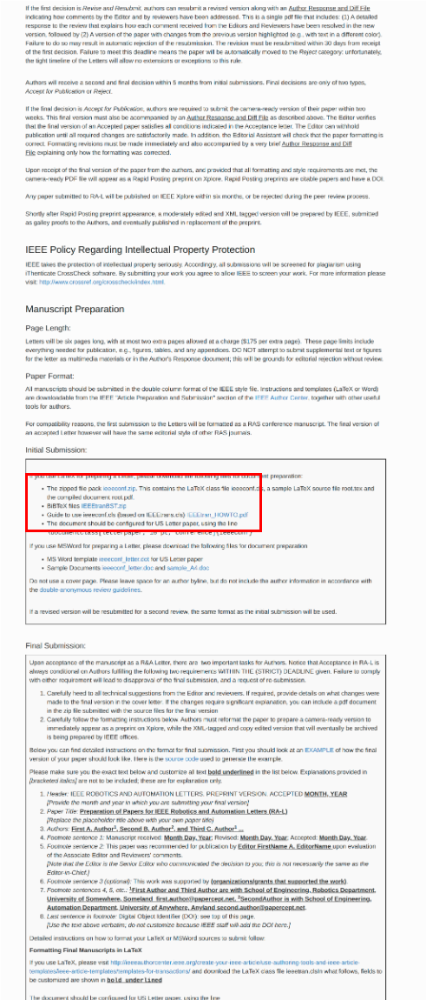
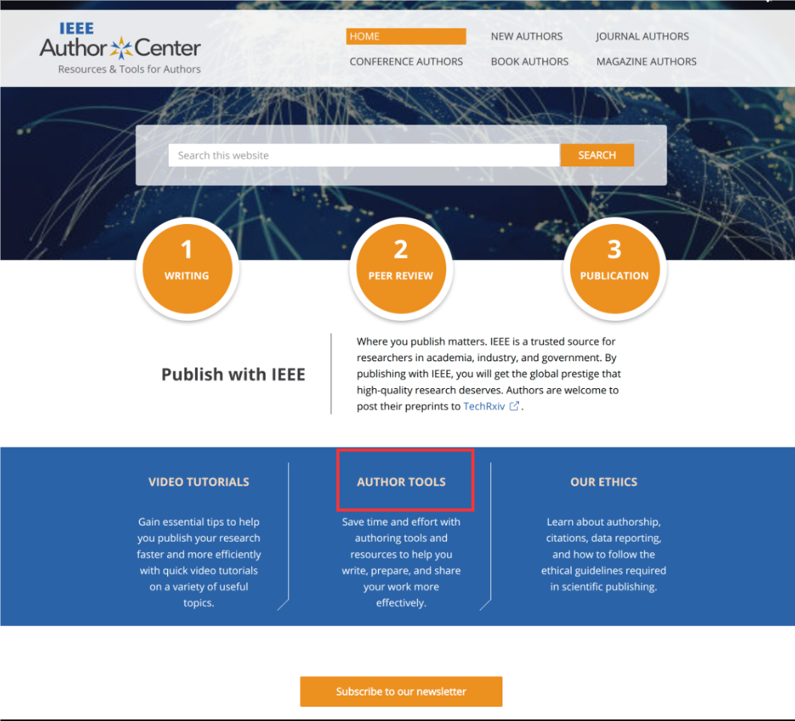
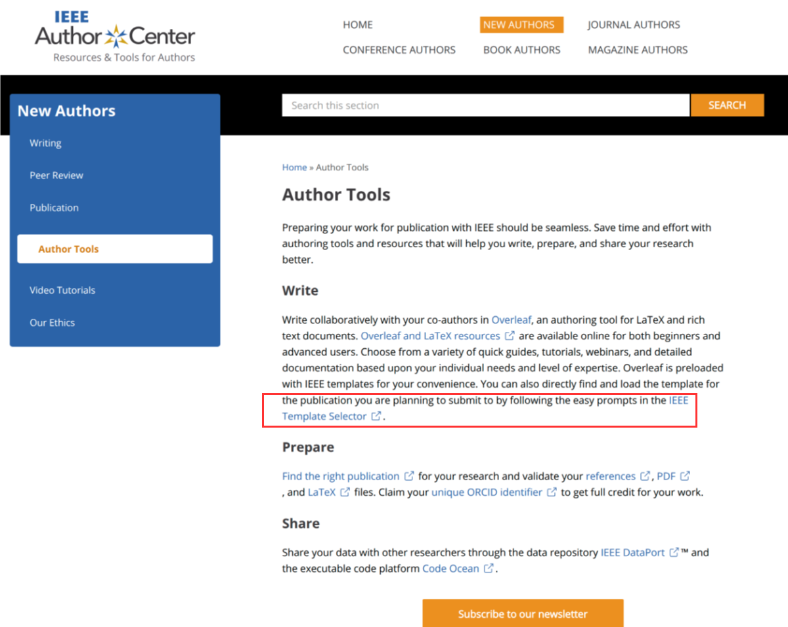
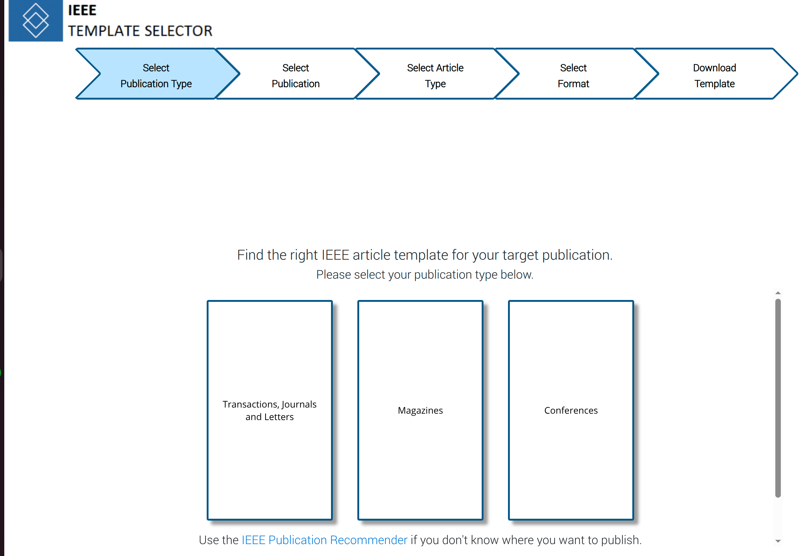

# RAL 投稿经验
## 0.模板下载
### 匿名模板
1.进入ieee[官方网站](https://ieeeauthorcenter.ieee.org/)

### 终稿模板
1.进入ieee[作者中心](https://ieeeauthorcenter.ieee.org/)，点击AUTHOR TOOLs（作者工具）

2.进入作者工具网站：Author Tools - IEEE Author Center New Authors，点击链接：IEEE Template Selector去选择模板

3.进入作者模板选择：依次进行选择，这里依次选择Transactions,journals and letters，输入期刊名称：IEEE Robotics and Automation Letters
选择文章类型;
选择文章写作格式;
最后点击下载即可.

